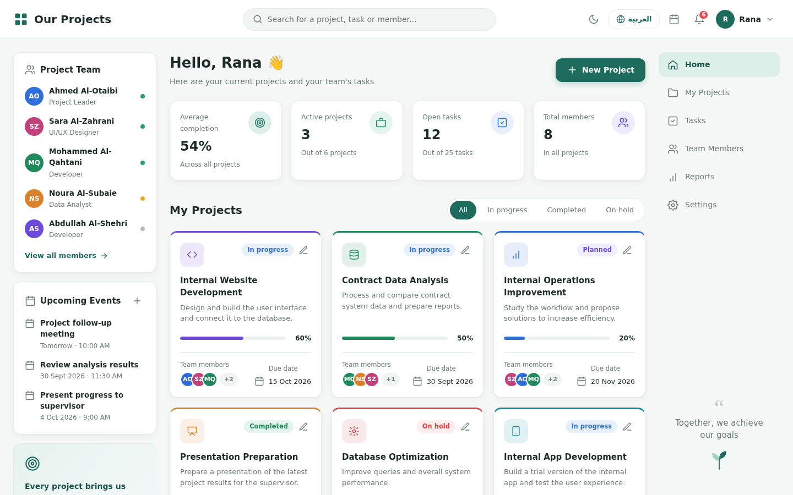
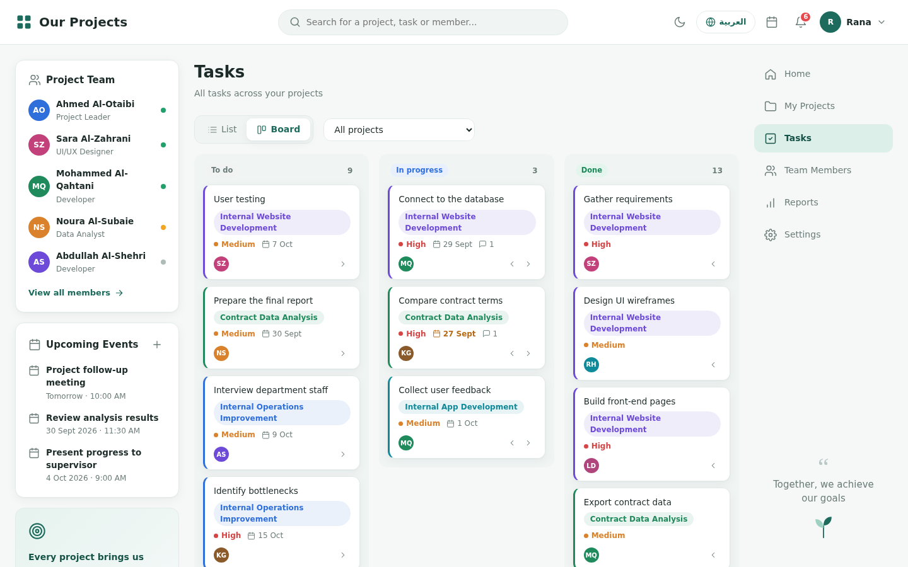
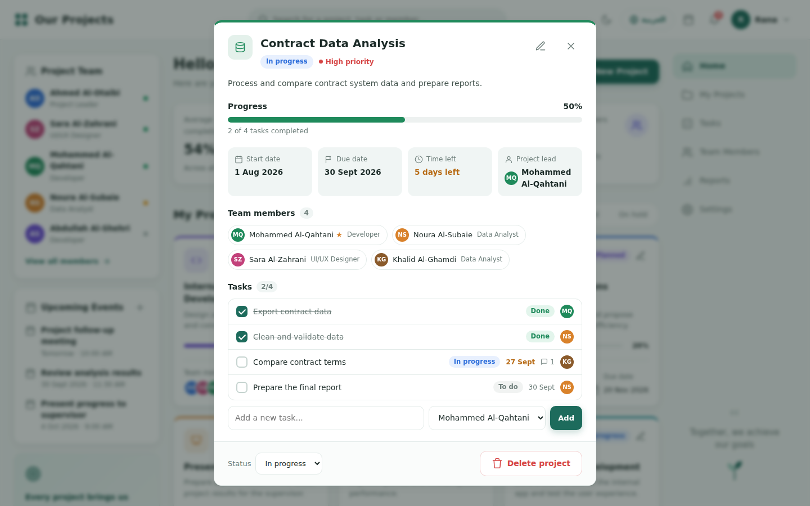
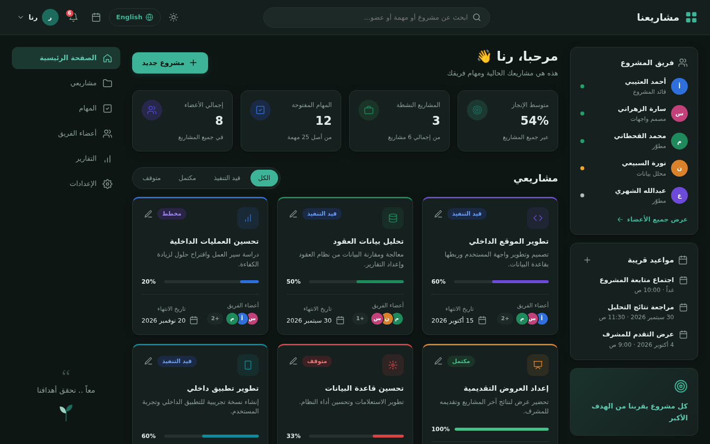
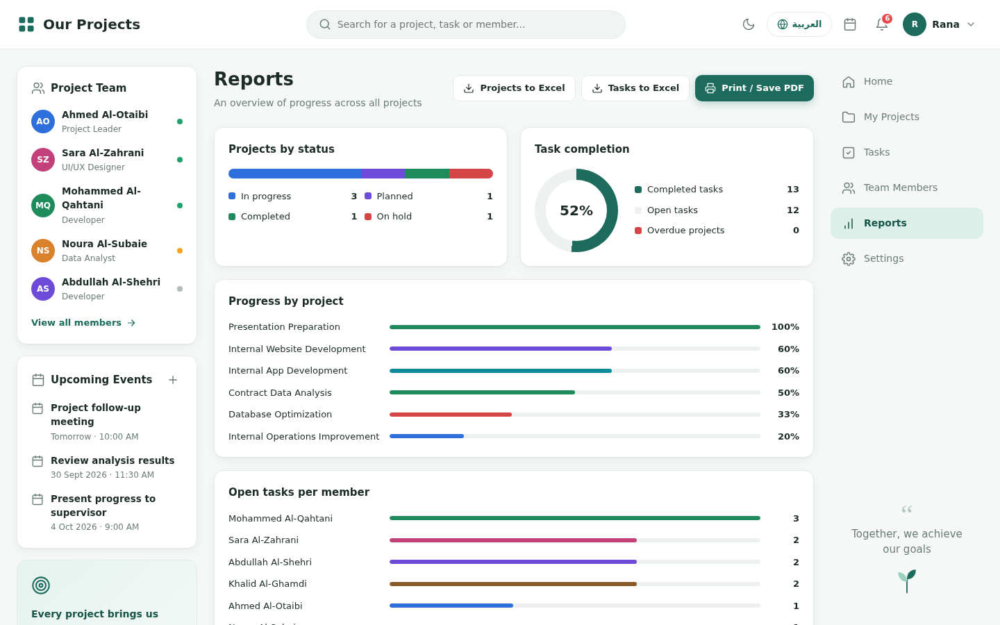
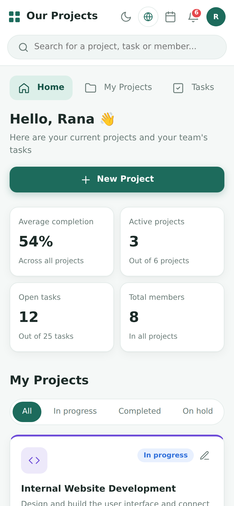

# Our Projects — Project Dashboard | مشاريعنا — لوحة إدارة المشاريع

A bilingual (English / العربية) project management dashboard built with plain **HTML, CSS and JavaScript**. No frameworks, no build step.

**🔗 Live demo:** https://rana1jaber.github.io/projects-dashboard/



## ✨ Features

- **Two languages.** English by default, Arabic with a full right-to-left layout, switched with one click.
- **Light and dark mode.** Your choice is remembered.
- **Projects.** Create, edit and delete projects, with a colour, an icon, a priority, dates, a project lead and team members.
- **Project details.** Progress, time left, team and tasks, all in one window.
- **Tasks.**
  - A list view and a **Kanban board**: drag tasks between *To do*, *In progress* and *Done*.
  - Each task has a status, a priority, a due date, a person assigned and **comments**.
- **Team.** Add and edit members, **upload a profile photo**, and pick a role, status and colour.
- **Calendar.** Shows project dates, task deadlines and meetings, and lets you **add your own events**.
- **Notifications.** Overdue projects and tasks, deadlines coming up, and meetings coming up.
- **Reports.** Charts for status, completion and workload. Export to **Excel (CSV)** or **print / save as PDF**.
- **Undo.** Every change can be undone from the small message at the bottom of the screen.
- **Installable app (PWA).** Add it to your phone's home screen, and it keeps working offline.
- **Works on phones, tablets and computers.**

All data is saved in the browser (`localStorage`).

## 📸 Screenshots

| Tasks board | Project details |
|---|---|
|  |  |

| Arabic + dark mode | Reports |
|---|---|
|  |  |

<p align="center"></p>

## 🗂️ Project structure

```
index.html              The page layout
css/style.css           All styles (light + dark themes, responsive, print)
js/icons.js             SVG icons
js/i18n.js              English and Arabic text
js/data.js              Sample data, saving to the browser, undo
js/utils.js             App state and small helpers (dates, avatars, search)
js/ui.js                Pop-up windows and toast messages
js/views.js             Pages: home, projects, tasks, team, reports, settings
js/projects.js          Project details and the new/edit project form
js/tasks.js             Task window, comments, board drag & drop
js/team.js              Add / edit / delete team members
js/calendar.js          Calendar, events and notifications
js/export.js            Excel (CSV) export and printing
js/pwa.js               Install-as-app support
js/app.js               Clicks, forms, keyboard and start-up
sw.js                   Offline support
manifest.webmanifest    App name and icons for installing
```

## 🚀 Run it locally

Download the files and open `index.html` in your browser. That's all.

To test the installable-app features, use a local server instead:

```bash
python -m http.server 8000
# then open http://localhost:8000
```

## 🛣️ Next steps

- Shared data for the whole team with a real database (Firebase) and sign-in.

---

Made by [@rana1jaber](https://github.com/rana1jaber)
